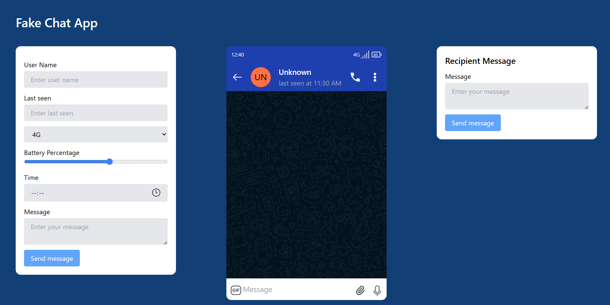
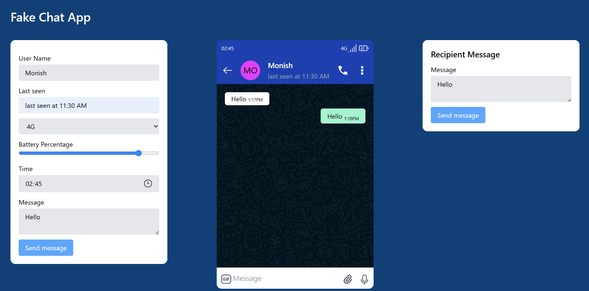

# Fake Chat App

A fake chat application built using React.js and Tailwind CSS, and bundled with Vite.

## Table of Contents
- [Screenshots](#screenshots)
- [Installation](#installation)
- [Usage](#usage)
- [Features](#features)
- [License](#license)

## Screenshots
- **ScreenShot 1**
  
- **ScreenShot 2**  
  

## Installation

To install and run this project locally, follow these steps:

1. Clone the repository:

```bash
git clone https://github.com/san1234100/fake-chat-app.git
```
2.Navigate into the project directory:
```bash
cd fake-chat-app
```

3.Install dependencies using npm or yarn:
```bash
npm install
```

4.Start the development server:
```bash
npm run dev
```

## Usage
- Once the development server is running, you can interact with the fake chat application. 
- Feel free to send messages, switch between different chat conversations, and explore the features.

## Features
- Simulated chat interface
- Multiple chat conversations
- Attractive design with Tailwind CSS
- Real-time updates (simulated)

## License
[Mit](./License)

# Happy coding!😁🧑‍💻